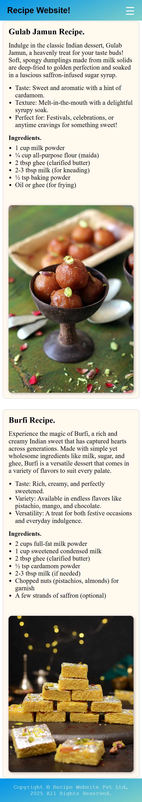

# 🍴 Recipe Website

This is a simple **Recipe Website** built using **HTML, CSS, and JavaScript**.  
It showcases traditional Indian sweets like **Gulab Jamun** and **Burfi**, along with their ingredients and descriptions.

---

## 🚀 Features
- Responsive **navbar** with hamburger menu  
- Recipe details with **ingredients list**  
- Attractive UI with **gradients and box shadows**  
- **Hover effects** on images and links  
- Footer with copyright  

---

## 🛠️ Technologies Used
- **HTML5**  
- **CSS3**  
- **JavaScript (for hamburger menu)**  

---

## 📷 Screenshot
Here’s a preview of the website 👇  



---

## 📌 How to Run
1. Clone this repository:  
   ```bash
   git clone https://github.com/shahbazal0m/recipe-website.git
